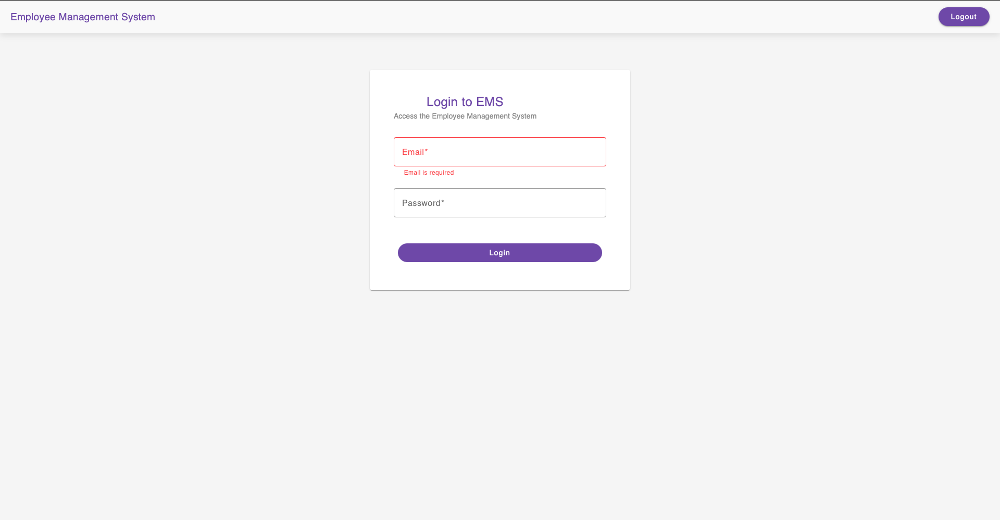
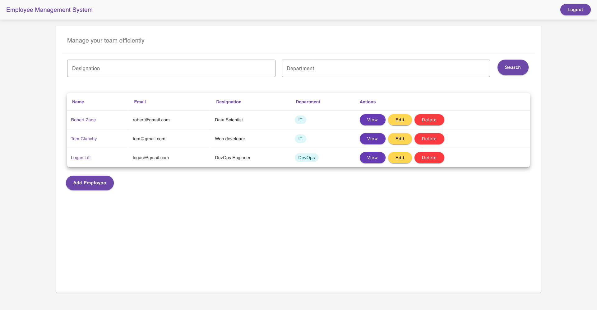
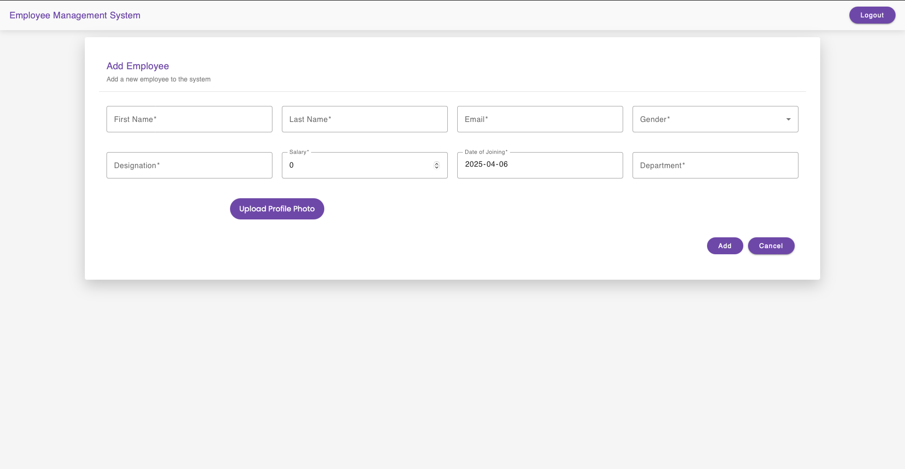
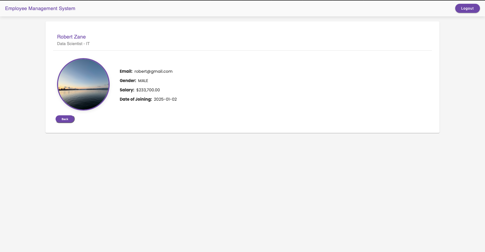
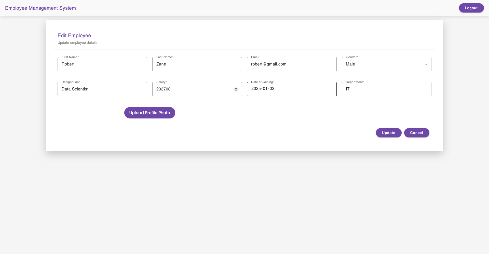

# Employee Management System

This is an **Employee Management System** built with **Angular** using a standalone component architecture. The application allows users to manage employee records, including viewing, adding, and editing employee details. It features user authentication (login/signup), Server-Side Rendering (SSR) for improved performance and SEO.

## Table of Contents

- [Features](#features)
- [Technologies Used](#technologies-used)
- [Project Structure](#project-structure)

## Features

- **User Authentication**:
  - Login and signup functionality with email and password.
  - Protected routes using an `AuthGuard` to restrict access to authenticated users only.
- **Employee Management**:
  - View a list of employees.
  - View details of a specific employee (`employee/:id` route).
  - Add or edit employee records using a form.
- **Server-Side Rendering (SSR)**:
  - Enabled SSR for faster initial page loads and better SEO.
  - Configured to work with standalone components (no `NgModule`).
- **Responsive UI**:
  - Built with Angular Material for a modern, responsive design.

## Technologies Used

- **Angular**: Frontend framework with standalone components.
- **TypeScript**: For type-safe JavaScript.
- **Angular Material**: For UI components (e.g., cards, forms, buttons).
- **RxJS**: For reactive programming and handling HTTP requests.
- **Zone.js**: For change detection in Angular.
- **Vite**: Build tool (used by Angular CLI for faster builds).
- **Render**: Hosting platform for deployment.
- **Node.js**: Runtime environment (used by Render).

## Project Structure

101410211_comp3133_assignment2/
├── src/
│   ├── app/
│   │   ├── components/
│   │   │   ├── employee-detail/
│   │   │   ├── employee-form/
│   │   │   ├── employee-list/
│   │   │   ├── login/
│   │   │   └── signup/
│   │   ├── guards/
│   │   │   └── auth.guard.ts
│   │   ├── services/
│   │   │   └── auth.service.ts
│   │   └── app.component.ts
│   ├── main.ts
│   ├── main.server.ts
│   ├── server.ts
│   ├── index.html
│   └── styles.css
├── angular.json
├── package.json
├── tsconfig.json
├── tsconfig.app.json
└── tsconfig.server.json

## Screen Shots

